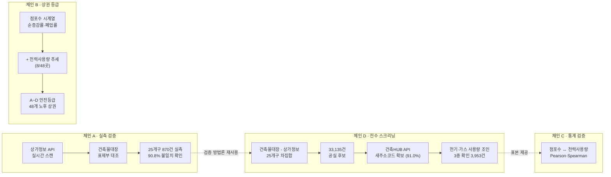

# 역산공실탐지 — 노후 상업건물 안전사각지대 진단 모델

[](LICENSE)


> **"등록된 정보와 실제로 일어나는 일은 다르다."**
> 2025년 5월, 세운상가 화재 당시 114개 점포 중 40여 개가 이미 공실이었다는 사실이
> 뒤늦게 드러났다. 사고가 나기 *전에* 이걸 알 방법은 없었을까 — 라는 질문에서
> 시작한 프로젝트다.

건물이 "비어 있다"는 건 어디에도 직접 등록되지 않는다. 그래서 서류상 등록된 정보와
현장에서 실제로 벌어지는 일의 **차집합**을 구해 공실을 역으로 계산했다. 여기에
전기·가스 사용량, 점포 수 시계열, 폐업률까지 겹쳐서 "확정 공실"이 아니라 "지금
확인이 필요한 후보"를 데이터로 좁혔다.

**2026 공공데이터 활용 경진대회 최우수상(2위)** 수상작.

---

## 숫자로 보는 결과

| | |
|---|---|
| 서울 25개구 전수조사 | 상업용 건물 **116,571건** |
| 등록-실제 차집합 공실 후보 | **33,135건** (28.4%) |
| 새주소코드 실측 매칭 | **30,154건** (91.0%, 전수 처리 완료) |
| 3중 확인(등록+미검색+에너지 미사용) 최종 후보 | **3,953건** (약 3.4%) |
| 실측 검증(서울 25개구, 870개 건물, 공공 API 실시간 조회) | 집합건축물 **90.8%**가 등록↔실제 불일치 |
| 폐업위험 조기경보 (Random Forest) | **AUC 0.881** |
| 점포수-전력사용량 상관관계 | Pearson r=0.254 · Spearman r=0.342 (둘 다 p<0.001, n=16,284) |
| 지역 위험도 클러스터링 (K-Means) | 전국 17개 시도 — 고위험 10·중위험 6·저위험 1 |

전체 산출물(리포트·지도·통계 근거)은 **[`index.html`](index.html)**에서 한눈에 볼 수 있다.

---

## 무엇을, 왜 만들었나

전수 안전점검은 불가능하다. 인력은 한정돼 있고, 서울 25개구 상업용 건물만 해도
11만 건이 넘는다. 그렇다고 신고가 들어올 때까지 기다리면 늦다 — 세운상가처럼.

이 프로젝트는 **"어느 건물부터 봐야 하는가"를 공공데이터 교차검증만으로 데이터로
답한다.** 확정 공실을 찾는 게 아니라, 신호 여러 개가 동시에 겹치는 건물만 후보로
좁혀서 점검 우선순위를 만드는 방식이다.

### 신호 하나로는 놓치는 것들을, 세 개로 겹쳐서 잡는다

| 신호만 단독으로 보면 | 놓치는 오탐 |
|---|---|
| 등록-실제 차집합만 | 최근 개업해 상가정보 API에 아직 안 뜬 곳도 공실로 오판 |
| + 전기·가스 미사용까지 겹치면 | 비신고 영업·개인 창고 활용 중인 곳은 에너지 신호로 걸러짐 |
| 대형 복합상가(호실 매칭 불가)는 별도로 | 점포수 순증감률 + 폐업률 + (일부) 전력사용량 추세로 A~D 등급화 |

---

## 파이프라인 구조



각 체인은 독립적으로 실행 가능하며, 산출물은 `cvs/*.csv`(로컬 전용, 미커밋)와
`html/*.html`(커밋됨, GitHub Pages처럼 바로 열람 가능)로 나온다.

---

## 엔지니어링 — 실제 운영 제약을 만나고 고친 것

공공 API는 일일 호출 한도가 있다. 33,135건을 개별 조회해야 하는 체인 D는
몇 시간이 걸리고 한도에도 걸린다. 그래서:

- **체크포인팅**: 성공/영구실패는 매 건 즉시 디스크에 append. 중간에 끊겨도
  유실 없이 그 지점부터 재개.
- **멱등 재실행**: 이미 결론 난 항목은 자동 스킵 — 같은 명령을 그냥 다시
  실행하면 됨. 재작업·중복 호출 없음.
- **호출 실패 ≠ 데이터 없음 구분**: 처음엔 "API 조회가 연속 15회 실패하면
  한도 초과로 보고 중단"하는 방식이었는데, 이게 *진짜 API 장애*와
  *"이 주소엔 건물이 없음"(정상 응답)*을 구분하지 못해 멀쩡한 API를 오판하고
  멈추는 경우가 있었다. 응답 상태코드와 포털 에러 코드를 직접 검사해 이 둘을
  분리하도록 고쳤더니, 며칠째 78%에 멈춰 있던 처리가 한 번에 91%까지 끝났다.

## 알려진 한계 (숨기지 않음)

- "3,953건"은 확정 공실이 아니라 **현장 확인이 필요한 후보** — 최근 개업·비신고
  영업 등으로 오탐 가능성이 있고, 리포트마다 이 전제를 명시함
- 상권 A~D 등급 중 전력사용량 신호까지 반영된 곳은 48곳 중 8곳뿐 — 나머지는
  주소명 중복 등으로 안전하게 매칭되지 않아 의도적으로 제외
- 스크립트 간 실행 순서를 강제하는 자동화가 없어 아래 순서를 수동으로 지켜야 함
- 단위 테스트 없음

---

## 기술 스택

Python · pandas · scikit-learn (Random Forest, K-Means) · 통계 검정
(Pearson·Spearman 상관, 두 비율 z-검정) · 공공데이터 REST API 연동
(소상공인시장진흥공단 상가정보 API, 국토교통부 건축HUB API) · Leaflet.js
(지도 시각화) · 개발 보조로 Claude Code 활용

## 환경 설정

```bash
pip install -r requirements.txt
```

시스템 기본 `python3`(예: macOS Homebrew python)에는 pandas 등이 안 깔려있을 수 있습니다.
conda 환경 등 별도 인터프리터를 쓴다면 아래처럼 `PYTHON` 변수로 지정합니다:

```bash
make install PYTHON=/opt/anaconda3/bin/python
make chain-a PYTHON=/opt/anaconda3/bin/python
```

`.env` 파일에 다음 키가 필요합니다 (스크립트별로 필요한 키가 다름):

```
SANGGA_API_KEY=   # 소상공인시장진흥공단 상가정보 API
BUILDING_API_KEY= # 국토교통부 건축HUB API
```

두 API 모두 [공공데이터포털](https://www.data.go.kr)에서 활용신청 후 발급받습니다.
`BUILDING_API_KEY`는 일일 호출한도가 있습니다(실측 약 1만 건/일 수준). 한도 소진이나
일시적 API 장애 시 호출이 실패하는데, `link_candidates_to_energy.py`는 이 실패가
연속으로 쌓이면 자동으로 멈추고, 다음 실행 시 처리된 항목은 건너뛰고 이어서 진행합니다.

## 필요한 원본 데이터 (커밋되지 않음 — `.gitignore`에 `cvs2/`, `*.csv` 포함)

| 파일/폴더 | 출처 | 비고 |
|---|---|---|
| `cvs/서울시_상권분석서비스_점포-상권__20XX년.csv` (2021~2025) | 서울시 우리마을가게 상권분석서비스 | |
| `cvs/임대동향_지역별_*.csv` | 한국부동산원 상업용부동산 임대동향 | |
| `cvs/한국산업단지공단_전국산업단지현황통계_노후산업단지_*.csv` | 한국산업단지공단 | |
| `국토교통부_전국_법정동_20260630.csv` | 국토교통부 | 법정동코드 매핑용 |
| `cvs2/전기에너지/*.csv`, `cvs2/가스에너지/*.csv` | 한국전력·도시가스 공급량 통계 (월별, 지역별) | 용량이 커서 로컬 전용 |
| `cvs2/건축물대장 정보_표제부.csv` | 건축데이터 개방시스템(open.eais.go.kr) | 서울 일부 표본 |
| `cvs2/건축물대장_표제부_8개구_전체.csv`, `cvs2/건축물대장_표제부_17개구_전체.csv` | 건축HUB "원하는대로 건축데이터" (지역: 8개구+17개구=25개구, 종류: 건축물대장, CSV) | commercial_vacancy_screening.py 필수 입력(둘 다 필요) |

## 실행 순서

스크립트 간 실행 순서를 강제하는 장치는 없으므로 아래 순서를 사람이 지켜서
실행해야 합니다. 괄호 안은 각 단계가 만드는 산출물입니다.

**체인 A — 실측 검증 → 건물연식 보강 → 의심건물 스크리닝**
```
python verification_scan.py          # cvs/verification_log.csv
python enrich_building_age.py        # cvs/verification_log_with_age.csv
python suspicious_building_ranking.py
```

**체인 B — 점포수 지표 → 안전등급 → 지도**
```
python alt_vacancy_indicator.py      # (risk_grade_model.py가 analyze() 재사용)
python risk_grade_model.py           # (safety_map.py가 compute_risk_grades() 재사용)
python safety_map.py
```

**체인 C — 에너지 지표 (전기/가스 사용량)**
```
python energy_vacancy_indicator.py   # 8개구 상가 스캔(캡 있음) + 에너지 조인 + 상관관계
```

**체인 D — 공실 후보 전수 스크리닝 → 에너지 3중검증**
```
python commercial_vacancy_screening.py   # cvs/vacancy_candidates.csv (서울 25개구 전수 차집합)
python link_candidates_to_energy.py      # 위 후보를 새주소코드 확보 후 에너지와 조인
                                          # (일일 API 호출한도로 여러 회차에 걸쳐 이어 실행될 수 있음.
                                          #  재실행 시 이미 해결된 후보는 자동으로 건너뜀)
```

**독립 실행 (서로 의존관계 없음)**
```
python dashboard.py
python clustering.py
python industrial_vacancy_indicator.py
python closure_risk_classifier.py
python vacancy_matching_poc.py
```

## 라이선스

[MIT](LICENSE)
